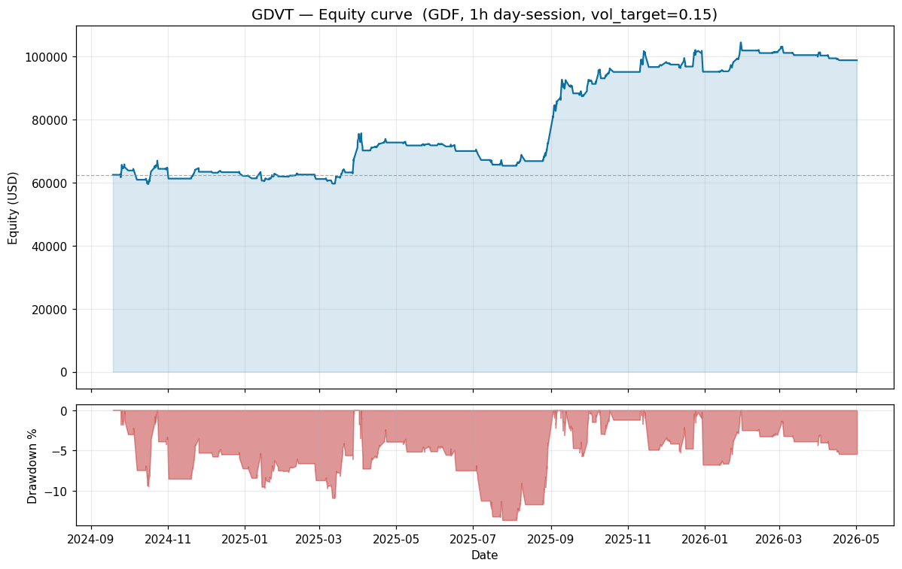

# GDVT — Gold Day-Session Vol-Targeted Trend

# **Disclaimer and Terms of Use**

**1. Educational Purpose Only**

This software is for educational and research purposes only and was built as
a personal project by PARVAUX, a Public Finance and Economics student. It is
not intended to be a source of financial advice, and the author is not a
registered financial advisor. The algorithms, signal generators, sizing
rules, and live-trading wrappers implemented herein — including trend
filters, breakout entries, ATR-scaled stops, and volatility-targeted
position sizing — are demonstrations of well-known quantitative concepts and
should not be construed as a recommendation to buy, sell, or hold any
specific security, commodity, or derivative contract.

**2. No Financial Advice**

Nothing in this repository constitutes professional financial, legal, or tax
advice. Investment decisions should be made based on your own research and
consultation with a qualified financial professional in your jurisdiction.
The strategies modeled in this software may not be suitable for your
specific financial situation, risk tolerance, or investment goals. Futures
trading involves substantial risk of loss and is not suitable for every
investor.

**3. Methodological and Modeling Risk**

a. **Past Performance.** Historical backtest results are not indicative of
   future results. The sample period is not long enough to characterize all
   macro regimes for gold.

b. **Proxy Data.** The backtest is run on a correlated global gold proxy as
   a stand-in for the exchange-listed contract the live wrapper would trade.
   The two products are correlated but not identical; spread, liquidity,
   microstructure, and trading-hour differences are not modeled.

c. **Cost Model.** Fees, tax, and slippage are modeled at conservative
   constants. Actual execution costs vary with order size, book depth, and
   market regime, and may materially exceed the modeled values during
   illiquid periods.

d. **Market Data.** Data fetched from third-party APIs may be delayed,
   inaccurate, incomplete, or revised after ingestion.

**4. Published in Non-Functional State**

This repository is published in a deliberately non-functional state. The
live-trading path will not execute as published, by design:

a. **Proprietary broker bridge SDK omitted.** A third-party broker bridge
   SDK required for live execution is governed by a redistribution-restricted
   license held by the platform provider. It is excluded from the repository
   (`.gitignore`) and must be obtained directly from the platform provider
   by any party seeking to operate the system.

b. **Account-specific parameters replaced with sample values.** The
   bridge-connection parameters in the live wrapper are set to sample
   values, not a real account. The script will fail at the bridge
   connection step without authentic credentials assigned to a valid
   account.

c. **Live order routing disabled at the code level.** The `DRY_RUN` flag in
   the live wrapper is hard-set to `True`. The order-submission call path is
   unreachable in the published version regardless of any other
   configuration. The disabling is intentional and is not a bug.

The backtest harness runs standalone against the included historical CSVs
and is the only path through this code intended to execute end-to-end.

**5. "AS-IS" Software Warranty**

**THIS SOFTWARE IS PROVIDED "AS IS", WITHOUT WARRANTY OF ANY KIND, EXPRESS
OR IMPLIED, INCLUDING BUT NOT LIMITED TO THE WARRANTIES OF MERCHANTABILITY,
FITNESS FOR A PARTICULAR PURPOSE, AND NON-INFRINGEMENT. IN NO EVENT SHALL
THE AUTHOR OR COPYRIGHT HOLDER BE LIABLE FOR ANY CLAIM, DAMAGES, OR OTHER
LIABILITY, WHETHER IN AN ACTION OF CONTRACT, TORT, OR OTHERWISE, ARISING
FROM, OUT OF, OR IN CONNECTION WITH THE SOFTWARE OR THE USE OR OTHER
DEALINGS IN THE SOFTWARE.**

**BY USING THIS SOFTWARE, YOU AGREE TO ASSUME ALL RISKS ASSOCIATED WITH YOUR
INVESTMENT, TRADING, AND HARDWARE DECISIONS, RELEASING THE AUTHOR (PARVAUX)
FROM ANY LIABILITY REGARDING YOUR FINANCIAL OUTCOMES OR SYSTEM INTEGRITY.**

---

A trend-following strategy for an exchange-listed gold futures contract.
Day-session only, single product, designed to sit on its hands until gold
actually moves. A slow daily trend regime filter gates intraday breakout
entries on hourly bars. ATR-scaled stops, volatility-targeted sizing, and a
hard force-flatten before session close every day so the book never carries
overnight gap risk.

This repository documents the **design reasoning and the experience of
building and running the system**. It intentionally does not publish the
tuned parameter values, the per-variant result tables, or the platform-level
workarounds — those were the output of a great deal of testing and
debugging, and the point of this repo is the reasoning and the lessons, not
a drop-in recipe. For a narrative writeup of the project and what it taught
me, see [docs/EXPERIENCE.md](docs/EXPERIENCE.md); see
[docs/STRATEGY.md](docs/STRATEGY.md) for the design philosophy and
[docs/BROKER_BRIDGE_NOTES.md](docs/BROKER_BRIDGE_NOTES.md) for the
integration lessons.

## Strategy in one paragraph

Trade only in the direction a slow daily trend regime allows — that's the
gate. When the gate is open, enter on an intraday breakout out of price's
recent range, size to a target portfolio volatility (capped by margin and a
hard max-lots), trail with an ATR-scaled chandelier stop, and force-flatten
before session close every day so no overnight exposure is ever carried.

The design was selected by in-sample/out-of-sample testing of several
variants. The one that survived was not the best in-sample performer but the
one whose out-of-sample result most closely matched its in-sample result —
the cleanest available signal that an edge is structural rather than fit to
noise. Details and the transferable lessons in
[docs/STRATEGY.md](docs/STRATEGY.md).

## Backtest



The backtest harness runs standalone against the included historical CSVs,
on a correlated global gold proxy at hourly resolution, with conservative
fee, tax, and slippage assumptions baked in. The headline result is a modest
sub-1.0 risk-adjusted return with a shallow drawdown over a multi-year
sample. The most important finding is qualitative and worth more than the
number: **adding even a single tick of slippage removed roughly a tenth of
the risk-adjusted return.** Gross performance flatters; only the net number
pays.

Backtest harness in [`gdvt_backtest.py`](gdvt_backtest.py).

## The live reality

Worth stating plainly because no backtest predicted it: on the live,
illiquid day-session contract, the underlying barely traded — on many days
on the order of a single real trade per day. A breakout system needs a range
to break out of, and there was nothing to break. Over the live window the
strategy produced almost no signals — not because it was broken, but because
the market it was pointed at was functionally idle while appearing open. The
gap between a backtest on a deep, liquid proxy and a live deployment on a
thin contract is the single biggest caveat in this whole project.

## Running it live

The live wrapper expects a vendor-supplied broker bridge app to be running
on the same machine. Because that SDK ships under a restrictive license and
isn't redistributable, it is gitignored — operators must obtain their own
copy from the platform provider. As noted in the disclaimer, the published
code cannot route live orders regardless of configuration.

## Files

```
gdvt_strategy.py        Pure strategy logic (signal + sizing). No I/O.
gdvt_backtest.py        Backtest harness with fee/tax/slippage model.
gdvt_live.py            Live wrapper — broker-bridge integration, tick
                        aggregator, order routing, force-flatten, position
                        persistence. (Published in disabled state.)
gdvt_supervisor.py      Auto-restart watchdog around gdvt_live.py.
preflight_check.py      Static checks before each launch.
tick_smoke_test.py      Short tick-flow probe.
refresh_data.py         Pulls fresh proxy daily + hourly bars.

orb_strategy.py         An alternate intraday variant, tested and rejected.
compare_variants.py     IS/OOS comparison harness used for selection.

gold_daily.csv          Daily proxy bars for trend-filter warmup.
gold_1h.csv             Hourly proxy bars for the backtest.

docs/STRATEGY.md              Design philosophy and the variant-selection lessons.
docs/BROKER_BRIDGE_NOTES.md   Lessons from integrating an undocumented bridge.
```

## What this project is really about

The strategy logic is roughly 10% of this codebase. The other 90% is
defensive engineering against an undocumented vendor broker bridge —
silently dormant data feeds, placeholder messages that crash naive parsers
while making health checks read green, order acknowledgements that mean
"accepted" rather than "filled," and timing logic that has to run on a
wall clock in the exchange's timezone. The portable lesson: on an obscure,
poorly-documented platform, the reliability engineering *is* the project.
See [docs/BROKER_BRIDGE_NOTES.md](docs/BROKER_BRIDGE_NOTES.md).

## Acknowledgments

Built with AI-assisted development; all design decisions, validation, and
final judgment are my own.

## License

MIT. See [LICENSE](LICENSE).
